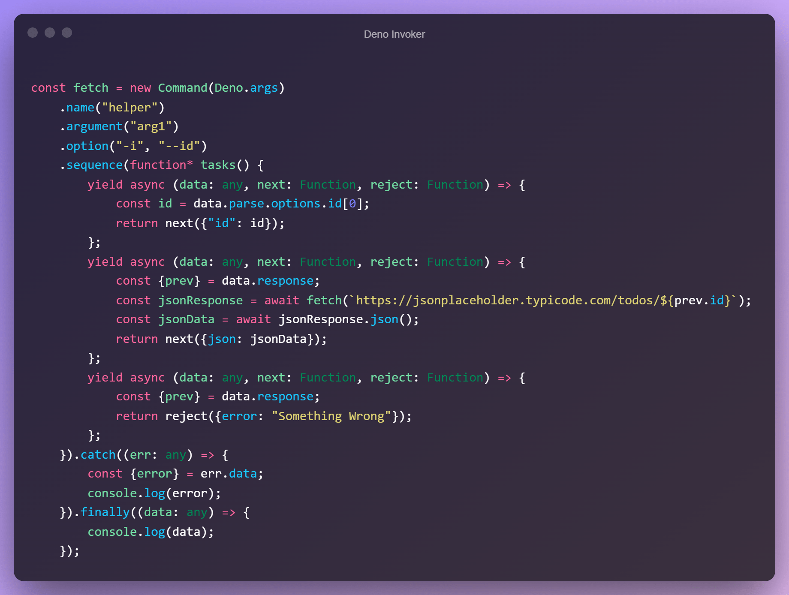

## Deno Invoker



```
import {Invoker, Command} from "./export.ts";
```

# Example:

```typescript
const invoker = new Invoker();

const get = new Command(Deno.args)
    .name("get")
    .argument("arg1")
    .option("-i", "--id")
    .sequence(function* tasks() {
        yield async (data: any, next: Function, reject: Function) => {
            const id = data.parse.options.id[0];
            return next({"id": id});
        };
        yield async (data: any, next: Function, reject: Function) => {
            const {prev} = data.response;
            const jsonResponse = await fetch(`https://jsonplaceholder.typicode.com/todos/${prev.id}`);
            const jsonData = await jsonResponse.json();
            return next({json: jsonData});
        };
        yield async (data: any, next: Function, reject: Function) => {
            const {prev} = data.response;
            return reject({error: "Something Wrong"});
        };
    }).catch((err: any) => {
        const {error} = err.data;
        console.log(error);
    }).finally((data: any) => {
        console.log(data);
    });

invoker.register([get]);
await invoker.run();
```

# run
```bash
deno run --allow-net .\filename.ts get -i 2
```
# task methods

- **next:** send data to next task;
- **reject:** reject task with data;
- **catch:** run after reject and receives reject data;
- **finally:** runs in the end

# data object

data object has **two** part

- **parse:** which parse command and gives you data about command

```json
{
    "parse": {
        "arguments": {},
        "options": {
            "id": [
                "2"
            ]
        },
        "unexpectedArgument": [],
        "unexpectedOptions": []
    }
}
```

- **response:** which gives you information passed but **next()** method 
    1. **prev:** contains data of previous task that passed by **next()**
    2. **stack:** contains all data of all task till this task

```json
 {
    "response": {
        "prev": {
            "status": true,
            "data": {
                "json": [
                    "Object"
                ]
            }
        },
        "stack": [
            {
                "status": true,
                "data": [
                    "Object"
                ]
            },
            {
                "status": true,
                "data": [
                    "Object"
                ]
            },
            {
                "status": false,
                "data": [
                    "Object"
                ]
            }
        ]
    }
}
```

# Full Data Object

```json
{
    "parse": {
        "arguments": {},
        "options": {
            "id": [
                "2"
            ]
        },
        "unexpectedArgument": [],
        "unexpectedOptions": []
    },
    "response": {
        "prev": {
            "status": true,
            "data": {
                "json": [
                    "Object"
                ]
            }
        },
        "stack": [
            {
                "status": true,
                "data": [
                    "Object"
                ]
            },
            {
                "status": true,
                "data": [
                    "Object"
                ]
            },
            {
                "status": false,
                "data": [
                    "Object"
                ]
            }
        ]
    }
}
```
